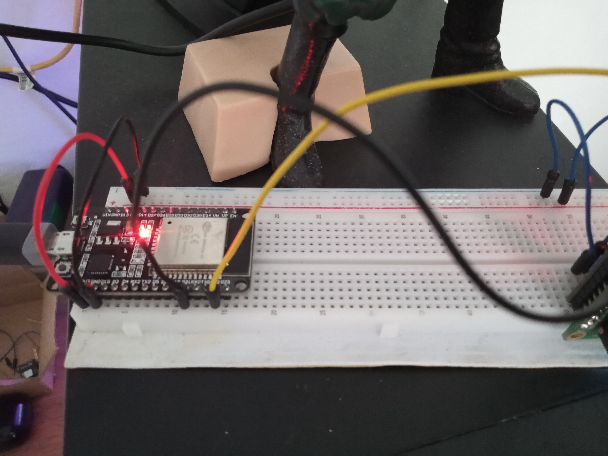
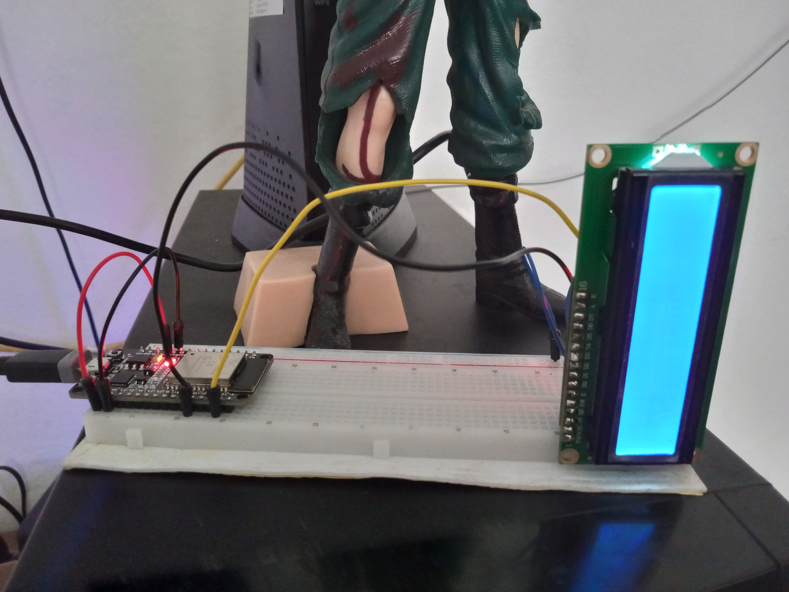

# Controle de Tomada com ESP32 e Monitoramento de Conexão à Internet 🛠️

Este projeto consiste em um sistema de controle de tomada utilizando um microcontrolador ESP32 e um módulo de monitoramento da conexão com a internet. O ESP32 é responsável por se comunicar com a tomada inteligente por meio da rede local e por verificar periodicamente a conexão com a internet.

## Funcionalidades 🚀

- Conexão à rede Wi-Fi local.
- Verificação periódica da conexão com a internet.
- Controle remoto de uma tomada inteligente.
- Monitoramento da conexão à internet.
- Indicação visual por meio de um LED do status da conexão à internet.

## Componentes Utilizados 🛠️

| Componente         | Descrição                                           |
|--------------------|-----------------------------------------------------|
| ESP32              | Microcontrolador utilizado para controle e monitoramento. |
| Tomada Inteligente | Dispositivo controlado remotamente pela rede local. |
| LED                | Indicação visual do status da conexão à internet.   |
| LCD                | Display para exibição de informações do sistema.    |
| Resistores, Jumpers, etc. | Componentes adicionais para conexões elétricas.  |

## Configuração ⚙️

### 🛡️ Mudanças necessárias  
| Funcionalidade  |     | Descrição                           |
| :---------- | :--------- | :---------------------------------- |
| `ssid ` |  | Nome da sua rede Wi-Fi local. |
| `password ` |  | Senha da sua rede Wi-Fi local. |
| `test_url ` |  | URL para testar a conexão com a internet (por exemplo, "https://www.google.com/"). |
| `tomada_ip ` |  | Endereço IP da sua tomada inteligente na rede local. |

## Uso 📋

1. O ESP32 irá se conectar à sua rede Wi-Fi.
2. Será realizado um teste de conexão com a internet periodicamente.
3. Caso a conexão falhe por um determinado número de tentativas consecutivas, a tomada inteligente será desligada.
4. O status da conexão é indicado visualmente por meio do LED.

## Demonstração em Vídeo 📹

Veja o sistema em ação neste vídeo:

https://github.com/WesleyS08/EcoSocket/assets/113936684/1dda0286-cee3-4d18-8716-514b48f9d2ff

## Contribuição 🤝

Contribuições são bem-vindas! Sinta-se à vontade para abrir uma issue para sugestões de melhorias ou novas funcionalidades.

## Licença 📝

Este projeto está licenciado sob a [MIT License](LICENSE).
